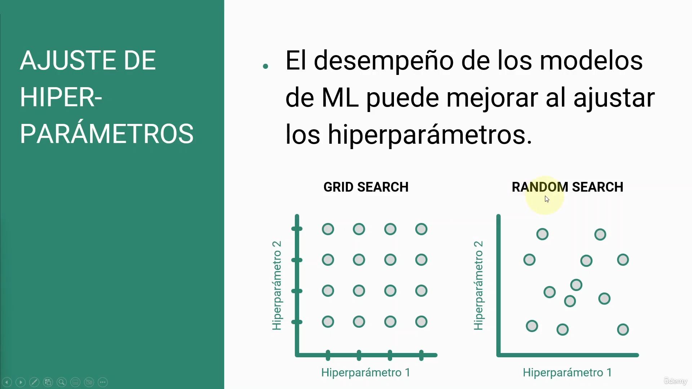
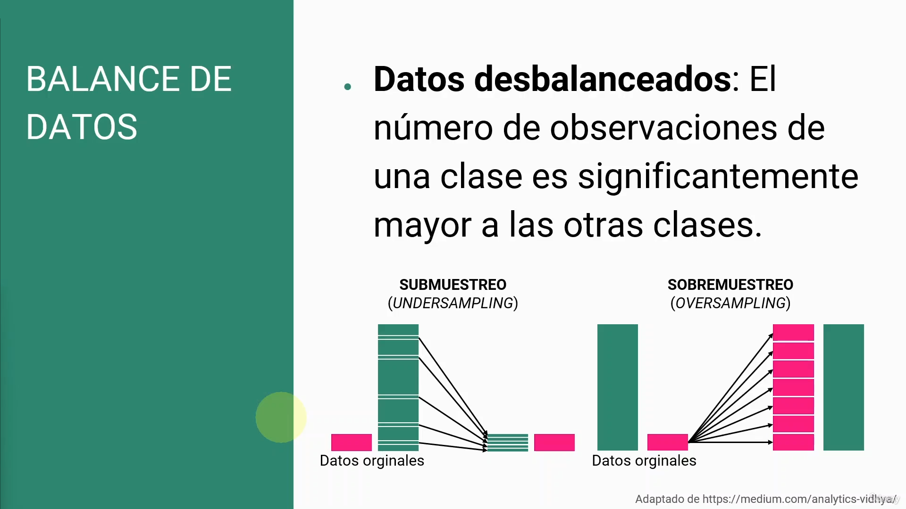

# ajuste de Hiper-Parametros

Grid search: con unas cuadricula o frame con el que podemos revisas todas las posibilidades con los datos.

Random search: Búsqueda aleatoria aunque no sea asegura que sean lso mejores.

# Balance de datos

Cuando no hay un balance correcto que nos puede empezar a dar problemas o sesgos.