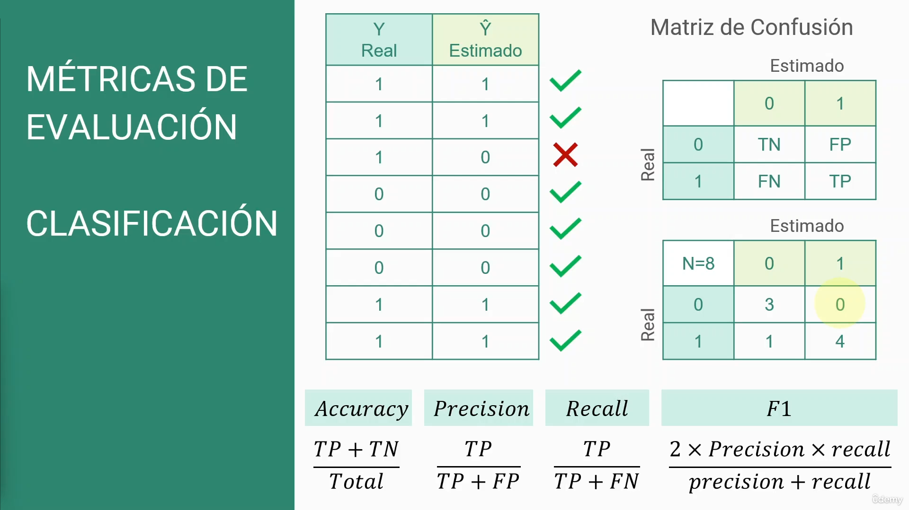
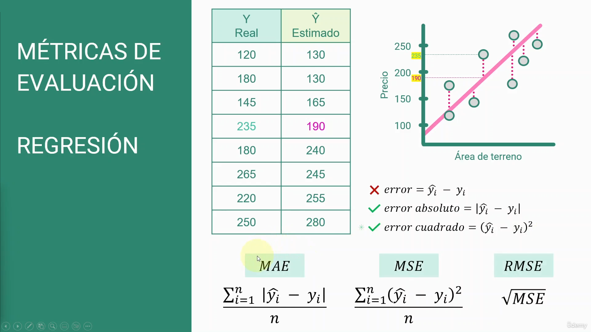

# Clasificación

Entender que tan bueno es nuestro modelo entendiendo que tanto varían nuestros datos de los datos correctos ó los que medimos.

# Regresion

predice el valor de datos desconocidos mediante el uso de otro valor de datos relacionado y conocido.
Usamos nuestros datos para hacer las predicciones y también entender el error y desviacion de nuestros datos estimados con respecto al medido.
