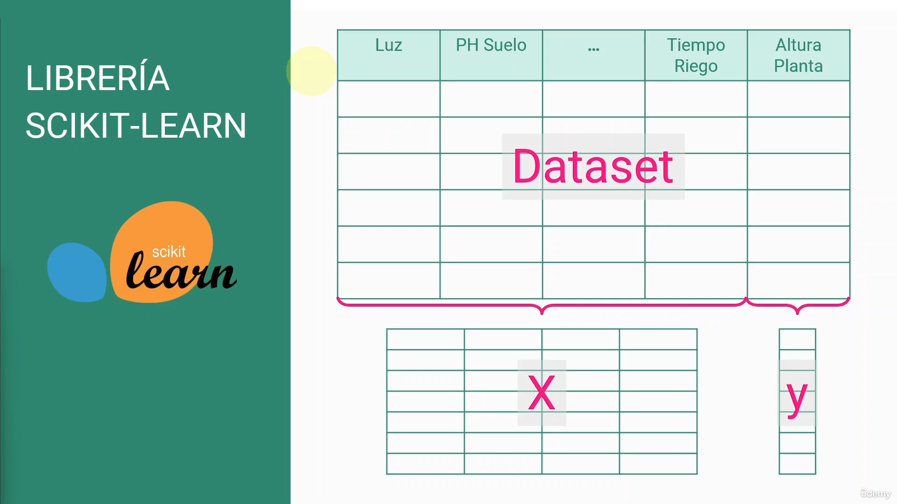
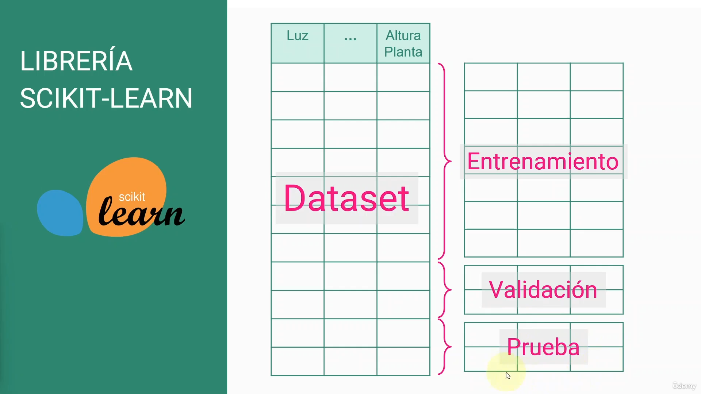
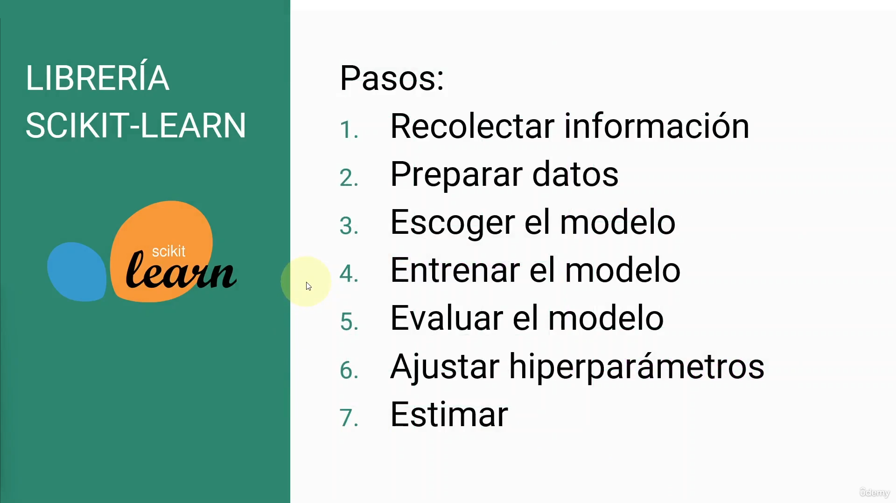
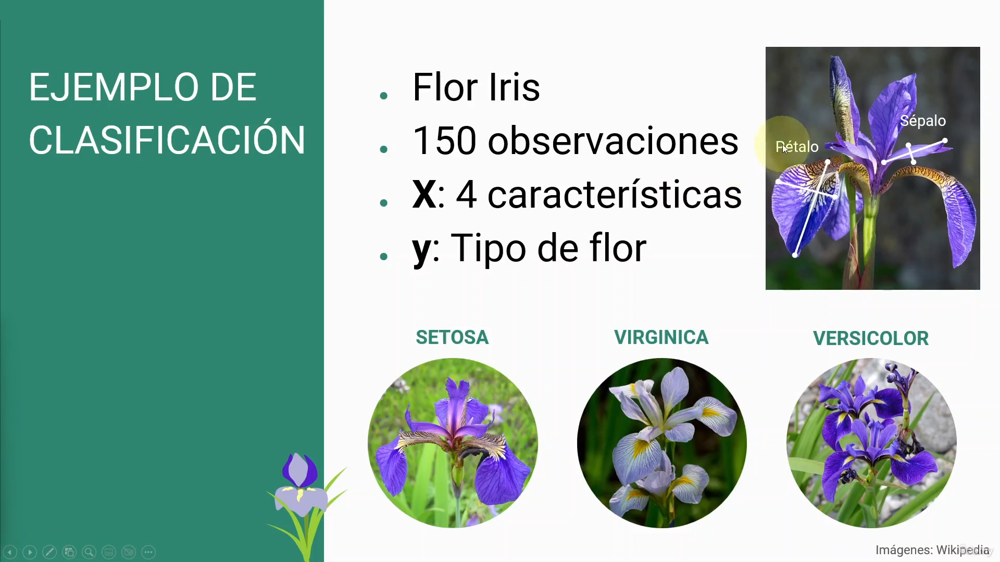

Para los datos obtenemos lso datos independientes y el de la altura de la planta acomo dependiente. En este caso es una forma buena de organizar los datos para darnos un mayor entendimiento del crecimiento de una planta con respecto a ciertos parámetros.

# Ciclo de vida

# Ejemplo

